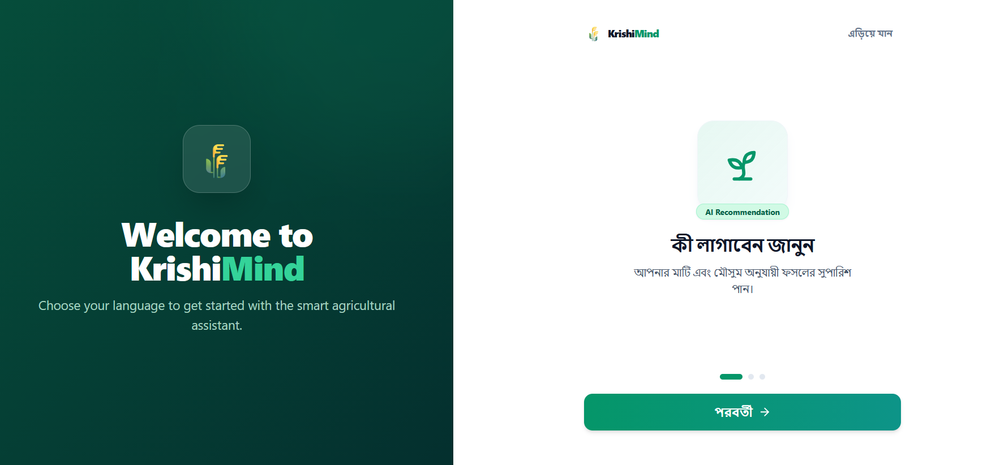
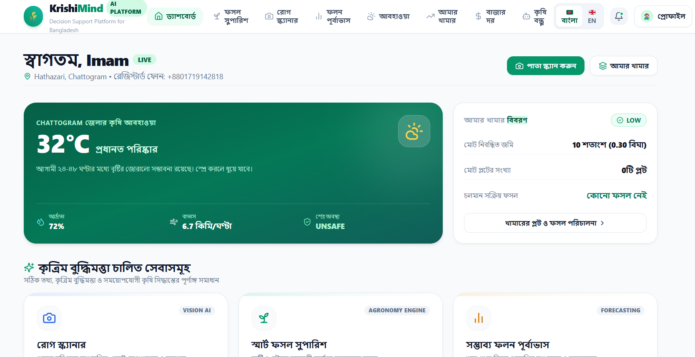
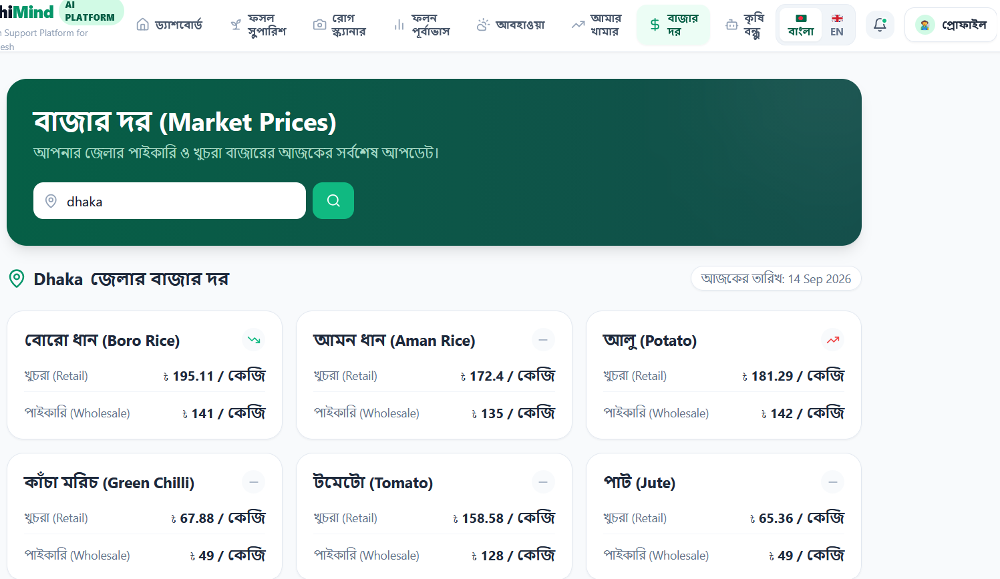
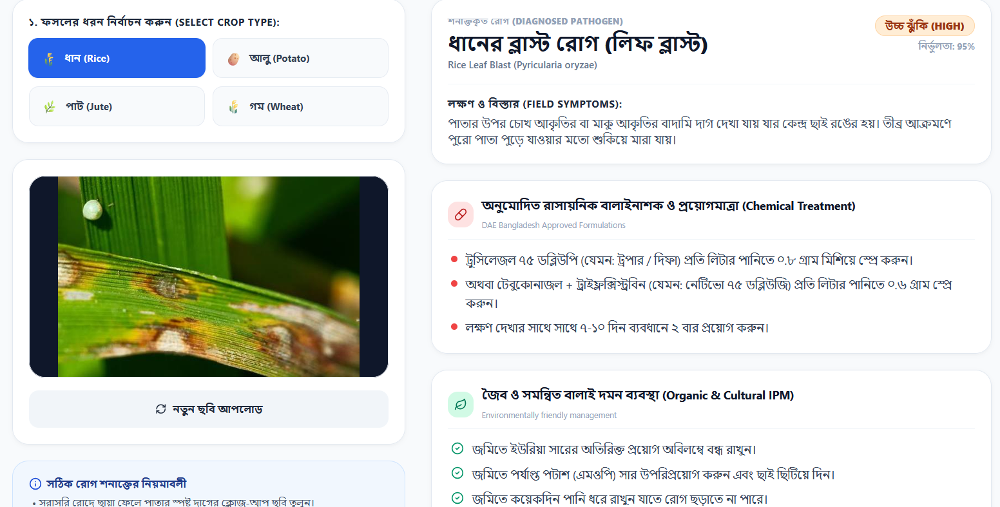
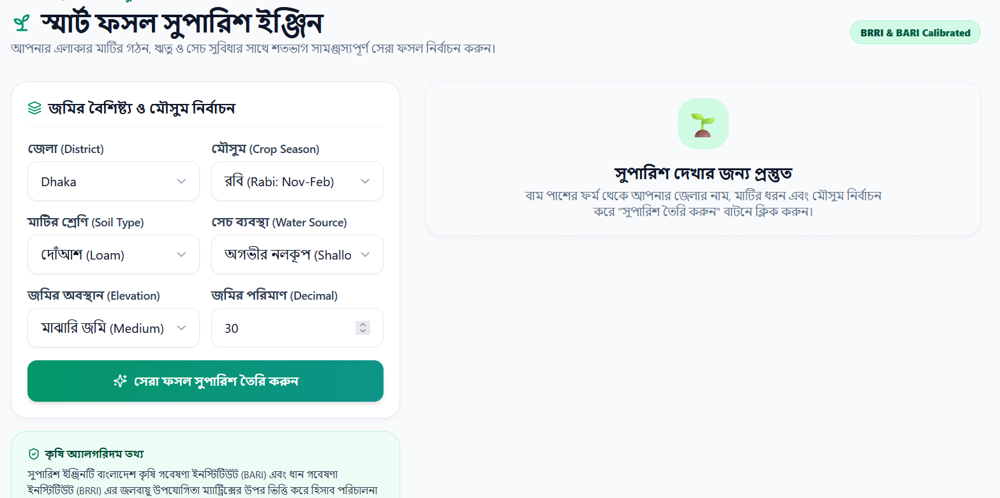
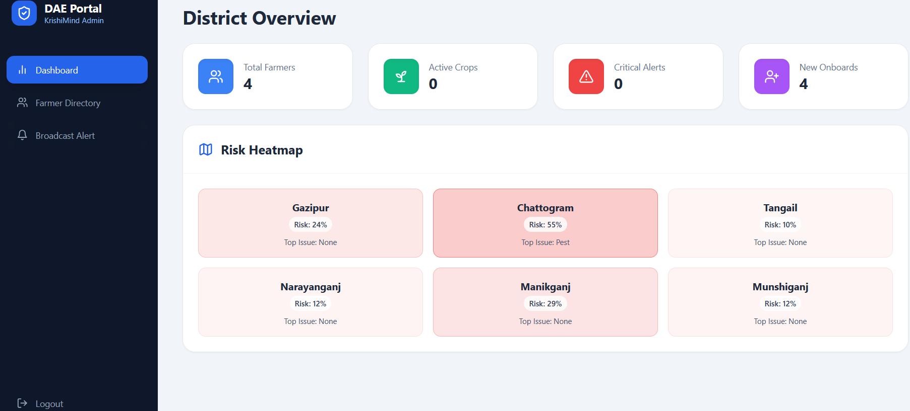

# 🌱 KrishiMind — Agro-Intelligent System

[](https://nextjs.org/)
[](https://fastapi.tiangolo.com/)
[](https://postgis.net/)
[](https://www.docker.com/)

**KrishiMind** is an AI-powered agricultural intelligence platform designed specifically for Bangladesh. It bridges the gap between grassroots farmers and government agricultural officers by providing real-time crop recommendations, AI disease scanning, market insights, and localized broadcast alerts via an intuitive bilingual (Bangla & English) interface.

---

## ✨ Key Features

### For Farmers 🌾
* **Bilingual Onboarding:** Easy setup using phone numbers with secure OTP verification, available natively in both English and Bengali.
* **Smart Farm Profiling:** Farmers can register their plots with specific soil types, land elevation, and water availability to receive tailored advice.
* **AI Crop Recommendations:** Powered by Gemini AI, suggests the most profitable and suitable crops based on plot conditions and current season.
* **Disease Scanner:** Upload photos of infected crops for instant AI-based disease diagnosis and actionable remedies.
* **Yield Prediction:** Machine learning models predict expected harvest volume using farm parameters.
* **Market Insights:** Real-time mandi (market) price tracking across various districts.
* **Agricultural Advisory:** Localized weather forecasts coupled with actionable agronomic advice.

### For DAE Officers 📊
* **Command Dashboard:** A professional analytics portal for district/regional officers to monitor agricultural activities.
* **Risk Heatmaps:** PostGIS-powered geospatial data visualization showing potential risk zones (e.g., floods, pests).
* **Broadcast Alerts:** Officers can send instantaneous, localized emergency push notifications to all farmers in specific districts via async Celery background workers.
* **Farmer Directory:** Searchable database tracking farmer onboarding and active crop progress.

---

## 📸 Screenshots

### Onboarding & Login
<p align="center">
  
</p>
<p align="center">
  
</p>

### Farmer Dashboard & Market Prices
<p align="center">
  
</p>
<p align="center">
  
</p>

### AI Core: Disease Scanner & Crop Recommendation
<p align="center">
  
</p>
<p align="center">
  
</p>

### AI Core: Yield Prediction & Intelligent Assistant
<p align="center">
  
</p>
<p align="center">
  
</p>

### Officer Analytics Portal
<p align="center">
  
</p>

---

## 🏗️ System Architecture

KrishiMind is built using a modern, scalable microservices architecture orchestrated with Docker Compose:

* **Frontend:** Next.js 14 (App Router), React, Tailwind CSS, TypeScript
* **Backend API:** FastAPI (Python 3.11), Pydantic v2
* **Database:** PostgreSQL 16 with PostGIS extensions (Asyncpg engine)
* **Background Workers:** Celery + Redis for async tasks (like bulk notifications)
* **ORM & Migrations:** SQLAlchemy 2.0 + Alembic
* **Authentication:** JWT (JSON Web Tokens) with secure bcrypt hashing
* **Reverse Proxy:** Nginx

---

## 🚀 Getting Started

### Prerequisites
Make sure you have [Docker](https://www.docker.com/products/docker-desktop/) and [Docker Compose](https://docs.docker.com/compose/) installed on your machine.

### 1. Clone the repository
```bash
git clone https://github.com/md-imam75/KrishiMind-Agro-Intelligent-System.git
cd KrishiMind-Agro-Intelligent-System
```

### 2. Environment Variables
Create a `.env` file in the `backend/` directory (you can copy `.env.example`):
```bash
cp backend/.env.example backend/.env
```
Ensure you add your `GEMINI_API_KEY` to the `.env` file for the AI features to work.

### 3. Build and Run via Docker Compose
Run the following command in the root directory to build the stack. (This process takes a few minutes as it pulls base images and installs dependencies).
```bash
docker compose up -d --build
```

### 4. Run Database Migrations
Once the containers are healthy, execute Alembic migrations to build the tables:
```bash
docker compose exec backend alembic upgrade head
```

### 5. Seed an Officer Account (Optional)
To test the Officer Dashboard, you can seed an admin account into the database:
```bash
docker compose exec backend python seed_officer.py
```
*(This creates an officer: `admin@krishimind.gov.bd` / `admin123` assigned to Chattogram)*

### 6. Access the Application
* **Web App (Farmers & Officers):** [http://localhost:3000](http://localhost:3000)
* **Backend API Documentation (Swagger):** [http://localhost:8000/docs](http://localhost:8000/docs)

---

## 🧪 Running Tests
The backend includes a comprehensive automated test suite (Pytest) for critical API endpoints.
```bash
docker compose exec backend pytest
```

---

## 🤝 Contributing
Contributions, issues, and feature requests are welcome! 
Feel free to check the [issues page](https://github.com/md-imam75/KrishiMind-Agro-Intelligent-System/issues).

---

## 📄 License
This project is licensed under the MIT License - see the LICENSE file for details.
